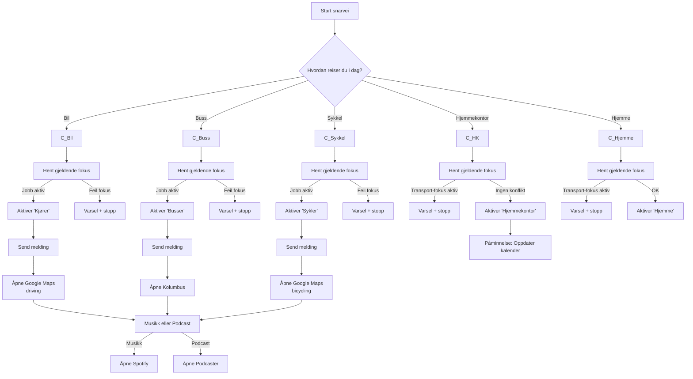

# 🚗🚌🚲 Jobb pendling – iOS Snarvei

En intelligent iOS-snarvei som samler **pendling, fokus-modus, varsling, navigasjon og underholdning** i én sømløs flyt.
Designet for daglig bruk – med innebygde sjekker som hindrer feil fokus, overlapp og unødvendige avbrytelser.

Snarveien tar hensyn til:
- Hvordan du reiser (bil, buss, sykkel, hjemmekontor)
- Hvilket fokus som allerede er aktivt
- Om noen skal varsles
- Automatisk navigasjon
- Valg av musikk eller podcast

---

## Diagram

Flyt som viser hovedlogikken i snarveien, fra valg av transport til fokus, navigasjon og media.

## ✨ Funksjoner

### 🚦 Transportvalg
Ved start blir du spurt:

> **Hvordan reiser du i dag?**

Tilgjengelige valg:
- 🚗 Bil
- 🚌 Buss
- 🚲 Sykkel
- 🏠 Hjemmekontor
- ❌ Hjemme

Hvert valg har egen logikk for fokus, varsler og navigasjon.

---

### 🔔 Varsling
Snarveien kan sende en forhåndsdefinert melding (SMS/iMessage) til valgt mottaker.

Eksempler:
- «Kjører hjem 😊»
- «Går til bussen 😅»
- «Sykler hjem nå 🚴‍♂️»

Meldingen genereres dynamisk basert på valgt transport.

---

### 🧠 Fokus-modus (automatisk)
Snarveien bruker **Hent gjeldende fokus** for å unngå konflikter.

Fokus brukt:
- **Kjører**
- **Busser**
- **Sykler**
- **Jobb**
- **Hjemmekontor**
- **Hjemme**

Regler:
- Hvis riktig fokus allerede er aktivt → varsling vises
- Hvis feil fokus er aktivt → snarveien stoppes
- Fokus aktiveres kun når ingen konflikter finnes

Dette hindrer overlappende eller feilaktige fokus-endringer.

---

### 🗺️ Navigasjon
Navigasjon åpnes automatisk i **Google Maps** via URL-skjema:

- Bil: `directionsmode=driving`
- Sykkel: `directionsmode=bicycling`

Destinasjon settes dynamisk basert på:
- Hjemadresse
- Jobbadresse

---

### 🎧 Musikk eller podcast
Etter at navigasjon er startet, blir du spurt:

> **Vil du høre på musikk eller podcast?**

Valg:
- 🎵 Musikk → åpner Spotify
- 🎙 Podcast → åpner Apple Podcaster

Dette steget kjøres likt i alle transportgrener.

---

### 🏠 Hjemmekontor / Hjemme
Spesiallogikk:
- Hjemmekontor kan kun aktiveres når ingen transport-fokus er aktive
- Ved konflikt → tydelig varsel vises
- Brukeren minnes på å oppdatere kalender ved hjemmekontor

---

## 🧩 Variabler

| Variabel | Beskrivelse |
|--------|-------------|
| `mottaker` | Kontakt som mottar melding |
| `adresseHjem` | Hjemadresse |
| `adresseJobb` | Jobbadresse |
| `meldingTekst` | Dynamisk generert melding |

---

## 🛡️ Designvalg og robusthet

- Ingen hardkodede meldinger i flere grener
- Alle fokus-endringer er beskyttet av sjekker
- Snarveien stopper seg selv ved konflikt
- Gjenbruk av meny for musikk/podcast

Dette gjør snarveien:
- Enkel å vedlikeholde
- Trygg i daglig bruk
- Lett å utvide

---

## 🚀 Videre forbedringer (idéer)

- Automatisk transportvalg basert på sted
- Tidsstyrt varsling
- Enkel logg av pendling
- Kalender-integrasjon

---

## ⬇️ Last ned snarveien

### 📲 Anbefalt (iPhone / iPad)
Åpne lenken under på iPhone eller iPad for å legge snarveien direkte til i **Snarveier-appen**:

👉 [Legg til «Jobb pendling» i Snarveier](https://www.icloud.com/shortcuts/3ccad90c297e43a38471e101177ccf80)

Når lenken åpnes på iOS vil du bli spurt om å legge snarveien til.

> ℹ️ Første gang du legger til snarveien må du kanskje tillate **Ubetrodde snarveier**  
> Dette styres i **Innstillinger → Snarveier**.

---

### 💾 Manuell nedlasting
Hvis du heller vil laste ned filen manuelt (f.eks. for arkivering eller inspeksjon):

👉 [Jobb pendling.shortcut](https://github.com/FriedCurmudgeon/ios-shortcuts/blob/main/shortcuts/Jobb%20pendling.shortcut)

> Merk: Manuell nedlasting gir **ikke** automatisk «Legg til i Snarveier»-dialog.  
> For best brukeropplevelse, bruk iCloud-lenken over.
---

